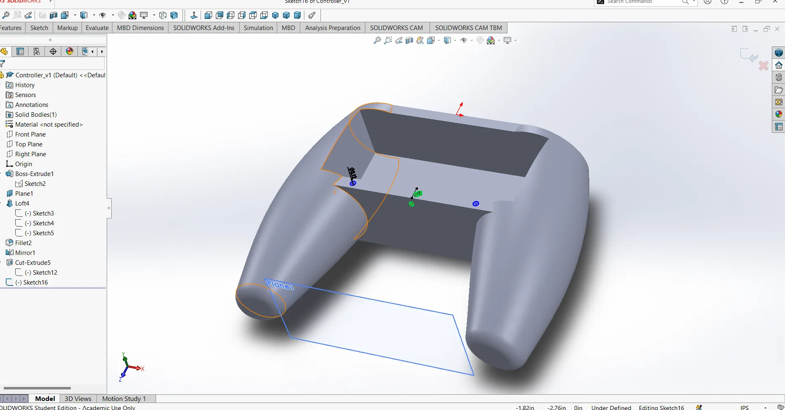

# BLE_controller

## Edit in library - Lemming Dev

To ensure that the right joystick works as expected, I needed to make a change in the library used. The edit was made to the setRightThumb function in the BleGamepad.cpp file. Change rZ -> rX so that axes 2 and 3 are set by this function instead of the original axes 2 and 5.

Now the right joystick works as expected

## Solidworks Model

## Circuit

## Flash Logging on ESP32

This project demonstrates how to log joystick calibration data into the ESP32’s internal flash using a lightweight filesystem (LITTLEFS). Each time the joystick calibration routine runs, the newly measured center values for the X and Y axes are appended to a log file stored in the device’s flash memory.

Why Flash Logging?
Persistent Storage
By writing calibration events to flash, the data remains available after power cycles or resets. This helps in long-term monitoring of hardware drift or identifying if repeated recalibrations are necessary.

Ease of Debugging
Storing calibration records directly on the ESP32 allows quick retrieval of past measurements for troubleshooting, without needing extra hardware like an SD card.

Low Overhead
Since calibration typically happens infrequently, writing to flash minimizes wear while providing the benefits of a simple, non-volatile logging solution.

Real-World Reliability
Engineers often need to account for sensor variance over time. Retaining calibration history on-device is a practical step toward more robust, self-diagnosing systems.

In summary, logging calibration data to the ESP32’s flash ensures that your joystick remains reliably tuned over time, while offering essential insight into hardware performance—key for any final-year electrical engineering project or real-world embedded application.
